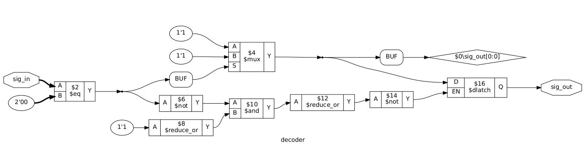
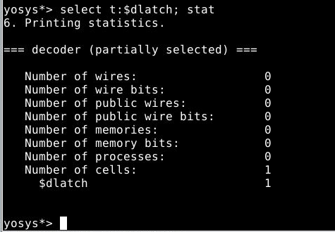
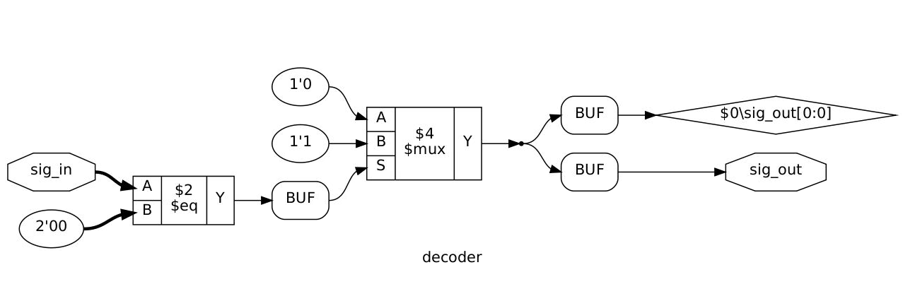
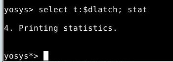
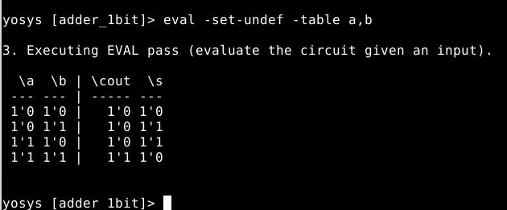

# 调研 - 性能指标评价

## 输出控制

可以用 `tee` 来重定向

## 关于综合

Yosys 用 `proc; opt; fsm; opt; memory; opt;` 五连可以进行 high-level 综合

用 `techmap; opt;` 进行底层综合

### RTL Cell

high-level 综合会综合到所有的 RTL Cell 中去。这些 RTL Cell 的仿真可以用 `techlibs/common/simlib.v  ` 来做。手册里面有些 cell 的描述不够详细，但是只要读一下 `simlab.v` 就完全可以明白这些对应的 cell 在干什么。

总结如下：

- Unary Operators
- Binary Operators
- Multiplexers （所有的分支逻辑都会综合成 MUX 的）
- Registers
  - D 触发器（`$dff`），异步复位 D 触发器（`$adff`），RS 触发器（`$sr`），D 锁存器（`$dlatch`，`$dlatchsr`）
  - `simlab.v` 里面额外看到的：`$dffsr`，`$dffe`，`$ff`
- Memories
- FSM（`$fsm`）
  - 用 `fsm_map` 可以把 `$fsm` 转换为具体的 RTL Cell

### Gate Cell

用 `techmap` 来把 RTL Cell 综合到 Gate Cell，准确的说是综合到一个内建的元件库（`techlibs/common/techmap.v`）。

> 在 `techmap.v` 的注释里面说，这个 pass 不会映射 `$mem` cell；要不就之前用 `memory;` 展开，要不就映射到平台的 RAM 实现上去

Gate Cell 和 RTL Cell 的最大区别就是 Gate Cell 是固定功能的单比特门，没有参数。`techlibs/common/simcells.v  ` 可以找到所有内建元件库的仿真模型。

部分门列举如下：（不全，具体可以看 `simcells.v` ）

```
Verilog                    Cell Type
Y = ~A                      $_NOT_
Y = A & B                   $_AND_
Y = A | B                   $_OR_
Y = A ^ B                   $_XOR_
Y = S ? B : A               $_MUX_
always @(negedge C) Q <= D  $_DFF_N_
always @(posedge C) Q <= D  $_DFF_P_

ClkEdge RstLvl RstVal Cell Type
negedge 0      0      $_DFF_NN0_
negedge 0      1      $_DFF_NN1_
negedge 1      0      $_DFF_NP0_
negedge 1      1      $_DFF_NP1_
posedge 0      0      $_DFF_PN0_
posedge 0      1      $_DFF_PN1_
posedge 1      0      $_DFF_PP0_
posedge 1      1      $_DFF_PP1_
```

### Gate Mapping

Gate-Level Technology Mapping 用来把 Gate Cell 真正映射到目标器件的元件上去。

这里我们要提供一个 `.lib` 文件（Liberty File），格式参考 （http://www.opensourceliberty.org/）

> 就是一个包含输入输出描述，Rise/Fall Time，Input/Output Load Type，cell 代价的文件

大概步骤如下：

1. 映射到平台上有的触发器类型，通过 `dfflibmap` 命令来完成，这个命令只关心 `.lib` 中的 register cell）
2. 映射组合逻辑，通过外部程序 `ABC` 和 `abc` pass 来完成，这个命令只关心 `.lib` 中的组合逻辑部分的 cell

## 仿真显示

`sim` 命令可以输出 `.vcd` 文件

## 调试 Yosys

- 默认是在 design context，`ls` `cd` `dump` 都可以用起来，详情见手册最后 Application Notes

  - 绝大多数命令也都是在 module context 也生效的（就是，可以只对那个 module 操作）
- 可以用 `select` 选择，然后 `show` 就可以只显示那个选择了的东西
  
- `select t:$add` 选择所有 `$add` 类型的 cell
  
- `submod` 用来把电路切出来一个子 module

- `show` ：生成 dot 文件

  - 可以考虑拿到浏览器上显示，也可以考虑用 write_spice 然后找显示网表的工具

  - dot 文件示例：

    ```
    digraph "counter" {
    label="counter";
    rankdir="LR";
    remincross=true;
    n4 [ shape=octagon, label="count", color="black", fontcolor="black" ];
    n5 [ shape=octagon, label="en", color="black", fontcolor="black" ];
    n6 [ shape=octagon, label="rst", color="black", fontcolor="black" ];
    n7 [ shape=octagon, label="clk", color="black", fontcolor="black" ];
    v0 [ label="4'0001" ];
    c11 [ shape=record, label="{{<p8> A|<p9> B}|$2\n$add|{<p10> Y}}" ];
    p1 [shape=box, style=rounded, label="PROC $1\ncounter.v:6"];
    c11:p10:e -> p1:w [color="black", style="setlinewidth(3)", label=""];
    p1:e -> n4:w [color="black", style="setlinewidth(3)", label=""];
    n4:e -> c11:p8:w [color="black", style="setlinewidth(3)", label=""];
    n4:e -> p1:w [color="black", style="setlinewidth(3)", label=""];
    n5:e -> p1:w [color="black", label=""];
    n6:e -> p1:w [color="black", label=""];
    n7:e -> p1:w [color="black", label=""];
    v0:e -> c11:p9:w [color="black", style="setlinewidth(3)", label=""];
    }
    ```

    

## 资源整理

- Yosys 手册后面有个 Application Notes，详细描述了 show 等命令
- cloudv.io 是一个用 Yosys 和 OpenTimer 搞的云硬件开发 IDE
- Qflow - 一个开源硬件 IDE 环境，从综合到布线
  - 有自己写的 router
  - http://opencircuitdesign.com/qflow/

## 正确性评价

### Yosys 角度

#### 有没有 latch 生成

> 只要检测 RTLIL 就行，用 select t:$啥啥啥

演示：

```verilog
// decoder_bad.v
module decoder(
    input [1:0] sig_in,
    output reg sig_out
);
    always @ (*) begin
        if (sig_in == 2'b00)
            sig_out <= 1;
    end
    
endmodule
```

对应的电路（`read_verilog` + `proc`）：



可以看到有个 `$dlatch` 生成。



这样可以发现有一个 `$dlatch` 。


```verilog
// decoder.v
module decoder(
    input [1:0] sig_in,
    output reg sig_out
);
    always @ (*) begin
        if (sig_in == 2'b00)
            sig_out <= 1;
        else
        	sig_out <= 0;
    end
    
endmodule
```

对应的电路（`read_verilog` + `proc`）：



对应统计：（啥都没有）




#### 有没有不可综合的语句

RTLIL 里面这个 initial 好像变成了 sync init 的这个更新条件，我们是不是可以检测这个条件？

> 其他的比如 fork, for, $display 什么的呢？
>
> forever 呢？
>
> 最好还是在 read_verilog -dump_ast1 那个阶段对 AST 做检测，或者干脆在外面检测也行

这个还要再想办法。

#### 看看状态机是二段式还是三段式

这个目前看来要在 AST 做，比较麻烦。

#### 限制可以用的操作符

这个可以用 select 来检测是否有出现不合法的操作符。

#### 组合逻辑真值表

用 `eval` 或者 `sat` 命令

演示：

```verilog
// comb_logic_1.v
module adder_1bit (
	input a,
	input b,
	input cin,
	output reg s,
	output reg cout
);

	always @ (*) begin
		{cout,s} = a + b;
	end

endmodule
```

利用如下命令：`read_verilog; proc; cd adder_1bit; eval -set-undef -table a,b`

（如果 `adder_1bit` 有子模块，一定要先 `flatten`，`eval` 和 `sat` 都需要 flattened module）



这样可以打印一个真值表出来。

#### 判断对某输出的所有可能输入，时序逻辑证明：`sat` 命令

 演示：暂缺

#### `check`：检查电路中的显然问题

  - 组合逻辑环
  - 一个 wire 有多于 1 个 driver
  - 没有 driver 的 wire

  演示：暂缺

#### Synthesis 本身是否正确： `test_autotb`

### SymbiYosys 角度

比 Yosys 本身的 SAT 多的功能：可以做 BMC + 可以解析 SystemVerilog

> TODO

## 性能评价

- 在一个虚拟硬件上进行评价

  - 比如，一个受限的 CMOS 电路环境

    - Oklahoma State University 提供的 stdcell：https://vlsiarch.ecen.okstate.edu/flows/

      Referrer: http://opencircuitdesign.com/verilog/

      里面有 SCMOS MOSIS AMI 0.6um, AMI 0.35um, TSMC 0.25um, TSMC 0.18um, 和 FreePDK45 的数据手册和 `.lib` 文件

      - License: https://vlsiarch.ecen.okstate.edu/flows/MOSIS_SCMOS/OSU_Copyright

        仅限用于教育和研究用途

  - 一个典型的 FPGA 环境

    - Lattice 的支持比较好，Xilinx 的很差
    - 可以考虑用 Vivado 直接来做（使用 `https://github.com/olofk/edalize` 来处理调用 Vivado 的复杂问题）

  - 或者 Minecraft 环境（看看 Minecraft-HDL？）

- 做什么评价呢？

  - 静态时序评价 （STA），在给定的时钟参数下

    场景的例子：乘法器越快，得分越高
  
  

## 数字电路直观展示

现在的 Dot 文件可能看起来比较丑，似乎需要更好的可视化方案（当然，也可以先这样）

也许可以试试某些电路软件的显示功能，我们导出网表就行。

## 一些思考

1. 需要一个比较好的方案来解析 Yosys 的输出

   - 需要考察可能的标识符命名，写出比较完善的正则来匹配

2. 需要一个比较好的“Task”抽象

   - 这些任务都很不相同，基本上只能用 shell 脚本串起来

   - 统一任务定义文件？

     直接一个任务一个 Docker？（但是 Docker 启动过于慢，应该还是要任务服务器的形式）

     ```
     [Task]
     Name=CombLogicTester
     Prerequisite=yosys
     RunExec=bash ${TASK_EXEC_DIR}/run.sh
     OutputType=score
     TimeLimit=100
     MemLimit=256
     CheckReturnStatus=true
   ```
     
     什么的

3. 是否需要多文件上传支持？

   - 相当于每个人上传的是一个“workspace”

     好处是可以上传复杂项目（比如 CPU），方便 Task 实现

     （比如我们自动把用户文件放到 `${TASK_USERDATA_DIR}` 用于评测）

   - 同时我们可以为简单的单文件题目提供一个 wrapper，方便用户操作
   
   

